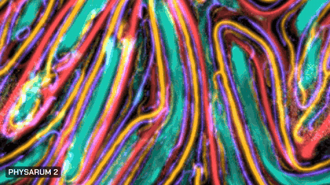

# Sine Visuals Lab

A free music visualizer that runs in your browser. Share your microphone or a
tab playing music, and a gallery of GPU simulations follows the beat, tempo
and tone of whatever is playing: a slime-mould colony, sand on a vibrating
plate, the light on the floor of a pool.

**Try it: [sinevisualslab.com](https://www.sinevisualslab.com)** — nothing to
install, no account, and the audio never leaves your device.
Press **F** for fullscreen and **S** for settings.



- **Scenes are simulations, not drawings.** Each one is written in raw
  WebGL2/GLSL with its state kept on the GPU, so it runs on phones as well as
  desktops.
- **It listens for rhythm, not just loudness.** It has its own beat and tempo
  tracker, and every reactive setting can pick what drives it: hits, the beat
  grid, the level, or a frequency line you draw.
- **It tunes itself.** An auto-tune engine adapts each scene's sensitivity,
  contrast and smoothing to the music's character in real time, and every
  control can be taken over by hand.

Scenes absent from `DRAFT_SCENE_IDS` (in `src/render/scenes/index.ts`) are
featured; the rest sit behind the gallery's draft toggle.

It's early and built by one person. Criticism, device reports, scene ideas and
pull requests are all welcome: open an issue, start a
[discussion](https://github.com/maksymenkoyr/sine-visuals-lab/discussions), or
see [Contributing](#contributing). Work in progress goes up on Instagram at
[@sinevisualslab](https://www.instagram.com/sinevisualslab/).

## Quick start

```
npm install
npm run dev          # visualizer + controller, served over HTTPS for mic access
npm run dev:worker    # Cloudflare Worker backend, for phone/TV room pairing
```

`npm run build` produces a static bundle (`tsc -b && vite build`). Two
deployed channels: pushing to `main` ships the **Insider** channel
(insider.sinevisualslab.com) automatically, on every push — see
[`.github/workflows/deploy.yml`](.github/workflows/deploy.yml). The **Stable**
channel (sinevisualslab.com — also what a local `npm run deploy` ships to)
only updates when `main` is merged into the `production` branch
(`npm run release` opens that pull request; merge it with a merge commit) —
see [`.github/workflows/release.yml`](.github/workflows/release.yml) and
`src/version.ts`. Every merge to `main` bumps the patch version, every release
bumps the minor, and the major is set by hand in `package.json`. Every open pull request also gets its own throwaway preview
Worker (URL posted as a comment on the PR).

## Architecture

- `src/audio/` — mic capture, FFT band extraction, sensitivity/contrast shaping.
- `src/render/` — the WebGL2 scenes, auto-tune engine, and shared render pipeline.
- `src/net/` — clock sync, jitter buffering, and the room protocol for an
  experimental mode that pairs a phone with a second screen over a WebSocket link.
- `src/ui/` — control panel, device picker, QR-code pairing screen.
- `server/` — the Cloudflare Worker + Durable Object that brokers pairing rooms.
- `src/tuning/` + `tools/` — a live tuning workflow (param bus, numeric probe,
  contact-sheet capture) for dialing in per-scene defaults against real audio.

Two entry points: `index.html` (the phone/controller view) and `tv.html`
(the paired display).

## Documentation

[`AGENTS.md`](AGENTS.md) carries the working rules ([`CLAUDE.md`](CLAUDE.md)
imports them for Claude Code); [`docs/index.md`](docs/index.md)
is the documentation map.

## Contributing

See [CONTRIBUTING.md](CONTRIBUTING.md). Contributions require agreeing to the
Contributor License Agreement in [CLA.md](CLA.md) — the why and how are
explained there.

## Privacy

Audio — from the microphone or a shared tab — is processed entirely on your
device and never transmitted; see [PRIVACY.md](PRIVACY.md) for the full
statement, including what pairing sends and what the host sees.

## License

Licensed under the GNU Affero General Public License v3.0 or later (AGPL-3.0-or-later)
— see [LICENSE](LICENSE). Copyright © 2026 Yaroslav Maksymenko.

Third-party dependencies bundled into the client build are listed in
[THIRD-PARTY-NOTICES.md](THIRD-PARTY-NOTICES.md).

The AGPL license grants no trademark rights (see AGPL-3.0 §7(e)): the Sine
Visuals Lab name and logo are trademarks of Yaroslav Maksymenko, so modified
versions and forks — welcome under the license — must ship under their own
name.
