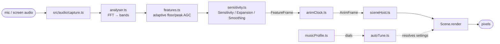
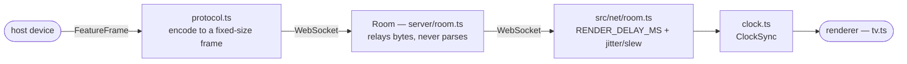

# Architecture

The one thing no single file shows: how a sound in the room becomes a pixel on
screen, and how that pixel ends up on a second device. Everything here is a map of
*relationships between files*. For what any one module actually does, read that
module's header — this doc doesn't restate it.

**Naming convention:** modules are named by basename and live under `src/` unless
written out — `analyser.ts` means `src/audio/analyser.ts`. Only basenames that
collide are written in full: `src/audio/capture.ts` vs `src/tuning/capture.ts`
(the tuning contact-sheet capture, see `docs/tuning.md`), `src/net/room.ts` vs
`server/room.ts`, and `src/render/scenes/index.ts`.

## Mic to pixel, on one device

**Capture and normalize.** `src/audio/capture.ts` opens the mic or, on a desktop
host, a shared screen/tab's audio — a user choice persisted by `sourcePref.ts`,
surfaced in the start prompt and the Input card's Source row — and hands back a raw
stream. `analyser.ts` runs the FFT and splits it into bands (`bandSplit.ts` and
`bandScale.ts` decide the edges). `features.ts` turns raw bands into a
`FeatureFrame` — this is where the adaptive floor/peak AGC lives, so everything
downstream sees a signal already normalized to the room's own loudness.
`sensitivity.ts` applies the user's Sensitivity/Expansion/Smoothing controls on top
of that.

**Shape it for motion.** Each render tick, `animClock.ts`'s `createAnimClock` takes
the current `FeatureFrame` and produces one `AnimFrame` — flow phase, phase-locked
beat/bar clock, per-band energy and onset pulses, section intensity, spectral
centroid (`spectralCentroid.ts`). **Scenes never read `FeatureFrame` fields
directly for anything animated; they read `AnimFrame`**, because it's already
shaped for motion (see the field comments in `animClock.ts` for why each one is
derived rather than a straight passthrough).

**Render it.** `sceneHost.ts`'s `SceneHost` owns the `mount`/`render`/`unmount`
calls against a `Scene` (`scene.ts`) — the interface every scene in
`src/render/scenes/` implements. Most scenes are built via `fullscreenScene.ts`'s
`createFullscreenScene`, which wraps a single fragment shader body with the common
uniform plumbing (`sceneCommon.ts`) and the setting → uniform wiring described in
`docs/adding-a-scene.md`.

**Auto-tune sits in the middle.** `autoTune.ts` sits between a scene's declared
`settings` and what actually reaches the shader, resolving each one against
`musicProfile.ts`'s dials unless the user (or `overrides.ts` in dev) has pinned it
manually.

**Routing.** `router.ts` decides which scene mounts (`#/` → gallery,
`#/v/<sceneId>` → one scene), read by `app.ts`, the phone/controller/gallery entry
(`index.html`).

**The meters read around the pipeline, not from it.** The controls panel's meters
(`audioMeters.ts`, under the spectrum card in `deviceMenu.ts`) are the one place
that reads outside this pipeline. The Scope card is fed by `waveformAnalyser.ts`
(math in `waveform.ts`), which reads time-domain samples straight off this device's
own mic — entirely separate from `FeatureFrame`/`AnimFrame` and never touching the
wire in "Phone to TV" below, so a viewer with no local mic doesn't get that card at
all. The Signal card's history trace likewise reads `FeatureExtractor.fixedEnergy`,
a local diagnostic off this device's own extractor (see `features.ts`), not a
`FeatureFrame` field. The Loudness card is the same kind of read: BS.1770 LUFS from
`lufsAnalyser.ts` (math in `lufs.ts`), a K-weighting chain off this device's own
capture, hidden on a mic-less renderer like the Scope.

**Signal links point a setting back at its meter.** `signals.ts` is the seam
between those meters and a scene's own `settings`: a scene can mark a
`SceneSetting` with `reads`, naming which of this file's `FeatureFrame`/`AnimFrame`
values actually drive it, and the device menu renders that as a live pill pointing
back at the meter row above.

## Phone to TV

`tv.ts` is the paired-display entry (`tv.html`). The two devices don't share a
process — they share a `FeatureFrame` stream over a WebSocket, relayed through a
Cloudflare Durable Object.

**Encoding.** `protocol.ts` encodes/decodes `FeatureFrame` to/from a fixed-size
binary frame. Read its header comment before touching the wire format — it
documents the current layout and a legacy-decode fallback with its own sunset
condition.

**Relay.** `server/room.ts` (the Durable Object, class `Room`, bound as `ROOM` per
`wrangler.toml`) relays frames between whichever device is host and whichever are
renderers. **It never parses a `FeatureFrame`** — bytes pass through untouched, so
protocol changes on the client side don't require a worker deploy.

**Smoothing on arrival.** `src/net/room.ts` (client side) is where the phone/TV
split becomes concrete: `RENDER_DELAY_MS` and the jitter/slew machinery
(`jitterBuffer.ts`, `slewLimiter.ts`) exist so a renderer's `uTime` moves smoothly
even when packets don't arrive smoothly. `clock.ts` (`ClockSync`) is what lets a
renderer interpret a host's `roomTimeMs` as its own local time.

**A solo device skips all of this.** A device that's alone in a room (no pairing)
never touches the net path — `app.ts` drives `AnimFrame` straight from its own
local `FeatureFrame`s.

## Where the quality/perf ceiling comes from

**Detect once, then let the user override.** `quality.ts` (`detectQuality`) picks a
quality preset once at startup; `qualityPref.ts` lets the user override it from the
Power card, defaulting to Auto (the detected preset).

**Step down under pressure — but verify the step helped.** `governor.ts` (the
quality governor) can step the effective preset down at runtime under sustained
frame-time pressure, judged against the render-rate cap that `framePace.ts` owns —
probing that a step down actually helped before trusting it, so a pace this page
doesn't control (a browser energy-saver mode, an OS refresh-rate cap) can't be
mistaken for GPU load.

**Scenes set their own floor.** A scene's `minQuality` (on the `Scene` interface)
opts it out of running below a given preset at all.

**Energy saving removes the governor rather than fighting it.** `powerMode.ts` is
the user-facing override — Energy saving's Auto/On/Off in the controls panel's
Power card (`powerCard.ts`) — that takes the governor out of the loop entirely.
