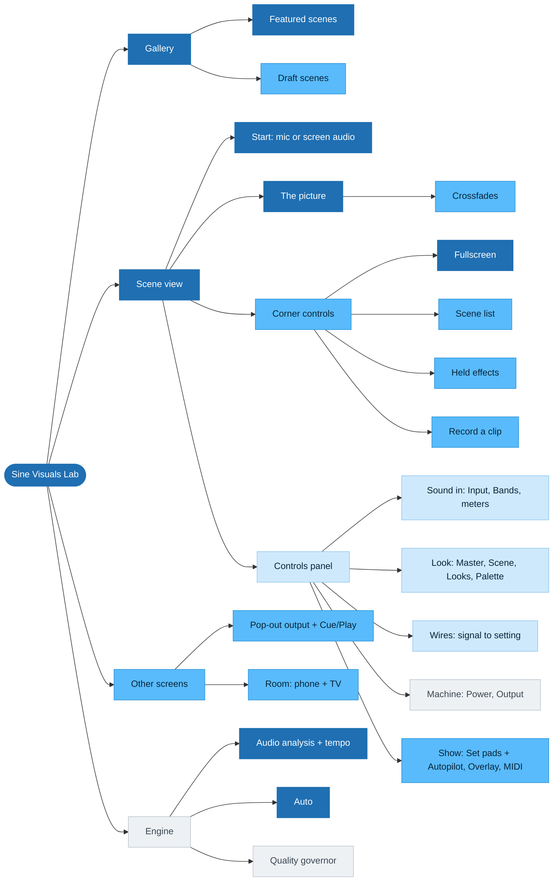

# Feature map

Every feature a visitor can meet, arranged as a tree by where they meet it,
and marked by how much it matters. [Architecture](architecture.md) is the
other half: how the code behind these features hangs together. This note
answers "what is there, and what is it worth", so it names each feature's
owning file and leaves the how to that file's header.

## How importance is marked

Each feature carries one mark:

| Mark | Tier | Means |
|---|---|---|
| ●●● | Core | Every visit goes through it. Without it there is no product. |
| ●●○ | Key | What makes one of the two audiences say yes. |
| ●○○ | Depth | For people who open the panel and tweak. |
| ○○○ | Under the hood | Readouts, diagnostics and plumbing a visitor never asks for. |

Two things decide the mark. Where the site measures it (scenes and audio
sources only, see Measured below), the numbers decide. Everywhere
else the mark is a judgement against the two audiences:

- **Hosts**: home-party hosts who want a nice vibe with no effort. "Just turn
  it on." A TV or a second monitor is a bonus, not the pitch.
- **DJs**: small DJs and artists who want their set to look good and be
  remembered, with no budget or crew for visuals.

A judged mark is a claim to test, not a finding. Change it when a measurement
says otherwise.

## The map

Darker means more important.

## The tree

### Gallery

- ●●● **Gallery** — the first screen: a tile per scene, each playing a
  synthetic demo feed until live audio starts · `src/ui/gallery.ts`
  - ●●● **Featured scenes** — the Released section, shown first: the scenes
    `sceneStage` calls released · `src/render/scenes/index.ts`
  - ●●○ **In development scenes** — scenes being worked on now, shown open
    below Released as small tiles · `IN_DEVELOPMENT_SCENE_IDS`
  - ●●○ **Draft scenes** — rougher scenes, greyed out behind the gallery's
    draft toggle. Measured: more than half of all scene views land on drafts
    or scenes in development · `DRAFT_SCENE_IDS`
  - ●○○ **Source picker** — Mic or Screen, chosen before a scene opens ·
    `src/audio/sourcePref.ts`
  - ○○○ **Version label and channel badge** — Stable or Insiders, links to the
    version history · `src/version.ts`

### Scene view

- ●●● **Start: mic or screen audio** — the start prompt opens the mic, or on a
  desktop a shared tab's or screen's audio · `src/audio/capture.ts`
  - ●○○ **Input device** — which input "mic" means, e.g. a USB interface fed
    from a DJ mixer · `src/audio/inputDevice.ts`
- ●●● **The picture** — the scene itself, drawn on live audio ·
  `src/render/sceneHost.ts`
  - ●●○ **Crossfades** — a scene change blends old into new, or cuts, starting
    on a beat; Cut or Fade and the Length are picked at the foot of the scene
    list · `src/render/crossfade.ts`, `src/render/sceneTransition.ts`
  - ●○○ **Pro options** — scene options locked until a Pro subscription exists;
    playable only in a dev build · `src/render/pro.ts`
- ●●○ **Corner controls**
  - ●●● **Fullscreen** — the chrome fades away while the picture plays ·
    `src/ui/fullscreen.ts`
  - ●●○ **Held effects** — effects that are on only while a key or button is
    held, from the bar at the bottom. For DJs · `src/ui/effectControls.ts`,
    the list is `EFFECTS` in `src/render/heldEffects.ts`
  - ●●○ **Record a clip** — saves the picture with its sound, cropped for a
    phone or a square post. For DJs, and for our own promos ·
    `src/ui/recordControls.ts`, `src/ui/clipRecorder.ts`
  - ●●○ **Scene list** — the scene's name in the top-left row opens every
    scene, to switch without going back to the gallery. For DJs ·
    `src/ui/scenePicker.ts`
  - ●○○ **Back to gallery, Stop, Room badge** — the top-left row ·
    `src/app.ts`
  - ○○○ **Wake lock** — keeps the screen on while a scene plays ·
    `src/ui/wakeLock.ts`
- ●○○ **Controls panel** — the left column, opened with the gear or S ·
  `src/ui/deviceMenu.ts`
  - ●○○ **Typed values** — click any slider's number and type one in place;
    a scene setting can go past its slider, marked ⚠ · `src/ui/typedValue.ts`,
    `src/render/customValues.ts`
  - ●○○ **Sound in**
    - ●○○ **Input card** — Source, device, Sensitivity, Expansion,
      Smoothing, the silence gate, and one Auto for the whole mic ·
      `src/ui/deviceMenu.ts`, `src/audio/silenceGate.ts`
    - ●○○ **Bands card** — the live spectrum, a fader per band, and a line
      you draw across it · `src/ui/spectrumStrip.ts`,
      `src/ui/bandFaders.ts`, `src/ui/bandLineEditor.ts`
    - ○○○ **Meters: Dynamics, Hits, Tempo, Character** — live readouts of
      what the analysis hears; each row's jack is a signal you can wire ·
      `src/ui/audioMeters.ts`, the dials are `MUSIC_DIALS`
      - ●○○ **Tap tempo** — tap Ctrl or the Tempo card's Tap to set the
        tracker's BPM. For DJs · `src/render/tapTempo.ts`
  - ●○○ **Look**
    - ●○○ **Master card** — Scale, Expansion and its shape for the whole
      scene, the picture meter, and Auto for everything ·
      `src/ui/leashGauge.ts`, `src/render/pictureMeter.ts`
    - ●○○ **Scene card** — the scene's own settings, each with Auto and
      Reset, plus any custom widget the scene declares ·
      `src/render/sceneSettings.ts`, `src/ui/widgets/registry.ts`
    - ●●○ **Looks card** — save the current settings as a named Look, apply
      it, or share it as a code. For both audiences: a host applies a Look
      someone else made · `src/ui/looksCard.ts`, `src/render/sceneLooks.ts`
    - ●●○ **Palette card** — the colour scheme, from `PALETTES`. The
      cheapest change that makes a scene feel new · `src/render/palette.ts`
  - ●○○ **Wires** — a signal's jack wired to a reactive setting's port, so
    the setting follows the sound. Words in [Vocabulary](vocabulary.md) ·
    `src/render/drives.ts`, `src/ui/cableLayer.ts`,
    `src/ui/driveSources.ts`
  - ●●○ **Show** — cards for playing a set live
    - ●●○ **Set card** — pads of Looks from any scene, fired by click or
      the number keys. For DJs · `src/ui/setCard.ts`,
      `src/render/sceneSet.ts`
      - ●●○ **Autopilot** — fires the pads by itself on bar boundaries. For
        hosts it is the closest thing to "just turn it on", but it needs
        pads first; with none set up it would be Core ·
        `src/render/setAutopilot.ts`
    - ●●○ **Overlay card** — a line of text and a logo over the visuals, on
      this screen, the pop-out and a paired TV. A DJ's name on the screen ·
      `src/ui/overlayCard.ts`, `src/render/overlayLayout.ts`
    - ●○○ **MIDI card** — connect a controller, learn knobs onto sliders
      and pads onto keys. Hidden where the browser has no Web MIDI. For DJs
      who own a controller · `src/ui/midiCard.ts`, `src/ui/midiInput.ts`
  - ○○○ **Machine**
    - ○○○ **Power card** — Quality, Energy saving, Panel blur, and live load
      readouts. Titled Preview while an output window is open ·
      `src/ui/powerCard.ts`
    - ○○○ **Output card** — the pop-out window's own Quality and Resolution ·
      `src/render/outputPower.ts`
  - ●○○ **Keys list, keycaps and tooltips** — every shortcut, from
    `SHORTCUTS`; hold Shift to see the keycaps · `src/ui/keyHints.ts`,
    `src/ui/tooltip.ts`

### Other screens

- ●●○ **Pop-out output** — a chrome-free second window for a projector or a
  second monitor. For DJs · `src/output.ts`, `src/net/outputSync.ts`
  - ●●○ **Cue and Play** — hold Cue to try a change on the output, Play to
    send it; hold Play to glide · `src/ui/outputControls.ts`,
    `src/ui/outputKeys.ts`
- ●●○ **Room** — devices that share one look over the network ·
  `src/ui/roomView.ts`, `server/roomCore.ts`
  - ●●○ **Phone as controller** — scan the laptop's QR: the phone or iPad
    opens on the room's picture, full screen, and a tap brings up the whole
    panel.
    Measured: a few sessions a month · `src/net/room.ts`, `src/app.ts`
    (`handheldScreen`)
  - ●●○ **TV** — a screen that draws the room's picture, paired by its own QR
    or a typed code. For hosts, as the bonus · `src/tv.ts`
  - ○○○ **Ears and screen per device** — whether a device listens itself or
    follows another's sound, and whether it shows Main or its own scene ·
    `src/net/ears.ts`, `server/roomDevices.ts`
- ●○○ **Look share codes and scene links** — a Look or a scene travels as a
  link · `src/render/sceneLooks.ts`, `src/router.ts`

### Engine

Nothing here has a button, but the Core features stand on it.

- ●●● **Audio analysis** — bands, levels, hits, all normalised to the room's
  own loudness · `src/audio/features.ts`
- ●●● **Tempo and beat** — the tracker, beat clock and metronome that put
  motion on the beat · `src/audio/tempoAnalyzer.ts`,
  `src/render/beatClock.ts`
- ●●● **Auto** — every setting resolves from the music unless someone pinned
  it. This is what makes "just turn it on" true · `src/render/autoTune.ts`,
  `src/render/musicProfile.ts`
- ○○○ **Quality governor** — steps quality down under sustained load so the
  frame rate holds · `src/render/governor.ts`
- ○○○ **Usage beacon** — counts scenes run on live audio, nothing else ·
  `src/net/usage.ts`, `server/usage.ts`

## Measured 2026-10-05

From `npm run usage`: the last 30 days, visitors only (the owner's `?me=1`
browsers left out). 71 sessions and 346 scene views. One day, 2026-10-01,
holds 37 of the sessions, so the sample is small and lumpy.

**How people start** (sessions):

| Source | Device | Sessions |
|---|---|---|
| mic | desktop | 37 |
| mic | mobile | 18 |
| screen audio | desktop | 12 |
| phone in a room | mobile | 4 |

**Scene views** (featured scenes marked ★):

| Scene | Views | Sessions opened on it |
|---|---|---|
| caustics ★ | 61 | 20 |
| chladni ★ | 40 | 14 |
| physarum2 ★ | 26 | 12 |
| sky ★ | 23 | 6 |
| fluid | 16 | 1 |
| storm | 16 | 3 |
| slats | 16 | 3 |
| cymatics | 13 | 4 |
| ink | 12 | 0 |
| dancers | 11 | 0 |
| silk | 10 | 1 |
| kaleidoscope | 10 | 0 |
| gates | 9 | 1 |
| ambience | 8 | 1 |
| ferrofluid | 8 | 0 |
| moire | 7 | 0 |
| petri | 7 | 1 |
| tessera | 6 | 0 |
| powder | 6 | 0 |
| shards | 6 | 0 |
| spectrum | 6 | 0 |
| moire2 | 6 | 1 |
| physarum | 5 | 1 |
| crystal | 5 | 1 |
| particles | 4 | 0 |
| tunnel | 4 | 1 |
| mesh | 3 | 0 |
| riso | 2 | 0 |

What it says:

- **The mic is the way in.** 55 of 71 sessions started on a mic, and 22
  were on a phone. The start flow on a phone is Core, not an afterthought.
- **People browse.** About five scene views per session. The four featured
  scenes open 52 of the 71 sessions and are the top four by views.
- **Drafts are used.** 196 of the 346 views are draft scenes, so the draft
  toggle is a Key feature, not a hiding place.
- **Rooms are rare.** Only 4 sessions came from a phone in a room. That fits
  "a TV is a bonus".

What it can't say: whether anyone opens the panel, pops out an output,
records, holds an effect, fires a pad or Autopilot, saves a Look, changes
the palette or pairs a TV. The beacon (`src/net/usage.ts`) only reports
scenes run on live audio. Every mark on those features is judged. To measure them, the beacon would need
more anonymous event kinds, which `PRIVACY.md` would then have to describe.

## Keeping this note current

- When a feature lands, moves or goes, edit its line in the tree and its
  box in the map in the same PR.
- Marks change only with a reason: a measurement, or a change in who the
  audiences are. Say which in the PR.
- The Measured section is a dated snapshot. Re-run `npm run usage` and
  rewrite it whole; don't patch single numbers.
